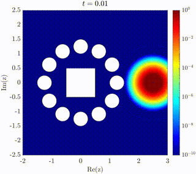
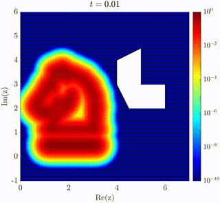
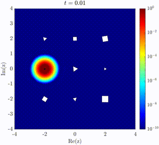

# Research Interests
Numerical analysis or scientific computing of rational approximations, mesh-free methods. Open to learning more about numerical integral methods or methods that necessitate implementation of methods from numerical linear algebra.

# Publications

**Hunter La Croix**, Alan E. Lindsay. *The Lightning Method for the Heat Equation.* Preprint. [pdf](https://www3.nd.edu/~alindsa1/Publications/LightningHeat.pdf) [code](https://github.com/hdlcmath/lightning-heat)

Dinesh Ekanayake, **Hunter La Croix**, Amy Ekanayake. *Alternative stable states and disease induced extinction.* Mathematical Modelling of Natural Phenomena 19 (2024): 18-33. [pdf](https://www.mmnp-journal.org/articles/mmnp/pdf/2024/01/mmnp230116.pdf)

# Talks

**Hunter La Croix**, Alan Lindsay. *The lightning method for the solution of planar diffusion equations with applications to chemical signaling.* SIAM AN25 MS111 Recent Advances in Pattern Formation in PDE's part II, Montreal, QC. July 2025.
