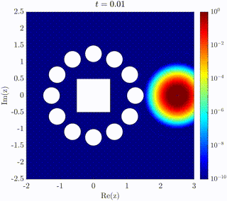
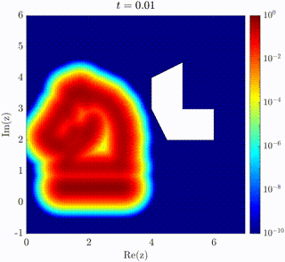
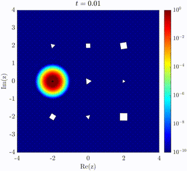

# Research Interests
Numerical analysis or scientific computing of rational approximations/mesh-free methods for linear PDE, numerical integral transform methods, numerical linear algebra.

# Publications

**Hunter La Croix**, Alan E. Lindsay. *The Lightning Method for the Heat Equation.* Journal of Scientific Computing, Vol. 107, No. 12, (2026). [pdf](https://link.springer.com/article/10.1007/s10915-026-03222-x) [ArXiV](https://arxiv.org/abs/2506.22576) [code](https://github.com/hdlcmath/lightning-heat)

Dinesh Ekanayake, **Hunter La Croix**, Amy Ekanayake. *Alternative stable states and disease induced extinction.* Mathematical Modelling of Natural Phenomena 19 (2024): 18-33. [pdf](https://www.mmnp-journal.org/articles/mmnp/pdf/2024/01/mmnp230116.pdf)

# Talks

**Hunter La Croix**, Alan Lindsay. "A Lightning Solver for the Solution of Planar Diffusion Equations with Applications to Chemical Signaling." SIAM LS26 MS35, Stochastic Transport and Resource Accumulation in Biology Part III, Cleveland, OH. July 2026.

**Hunter La Croix**, Alan Lindsay. "A Lightning Heat Solver." NAHOM 2026, Function Approximation and Sampling, Santa Fe NM. June 2026.

**Hunter La Croix**, Alan Lindsay. "A Lightning Solver for the Solution of Planar Diffusion Equations." Midwest Numerical Analysis Day 2026, Notre Dame, IN. April 2026.

**Hunter La Croix**, Alan Lindsay. *The Lightning Method for the Solution of Planar Diffusion Equations with Applications to Chemical Signaling.* SIAM AN25 MS111, Recent Advances in Pattern Formation in PDE's part II, Montreal, QC. July 2025.
